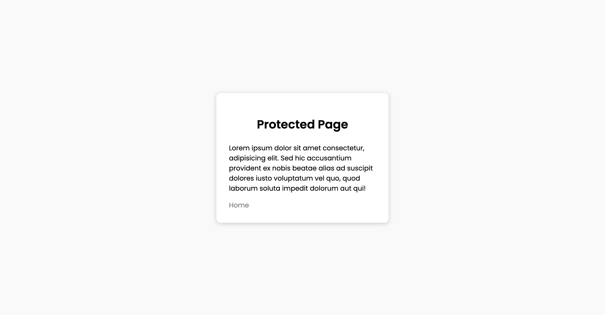

# Django Authentication Project

## Project Overview

This is a user authentication project built using the Django framework, providing essential functionalities such as user registration, login, and logout.

## Features

- **User Registration**: Allows new users to create an account.
- **User Login**: Users can log in using their username and password.
- **User Logout**: Users can securely log out of their accounts.
- **Error Handling**: Provides appropriate error messages, such as invalid credentials.

## Technology Stack

- **Python**: 3.12.3
- **Django**: 5.1.1
- **HTML/CSS**: For the front-end interface
- **SQLite**: For the development environment database

## Usage Example

- Visit the registration page and create a new user.
- Log in using the registered username and password.
- Test the logout functionality.

## Screenshots

